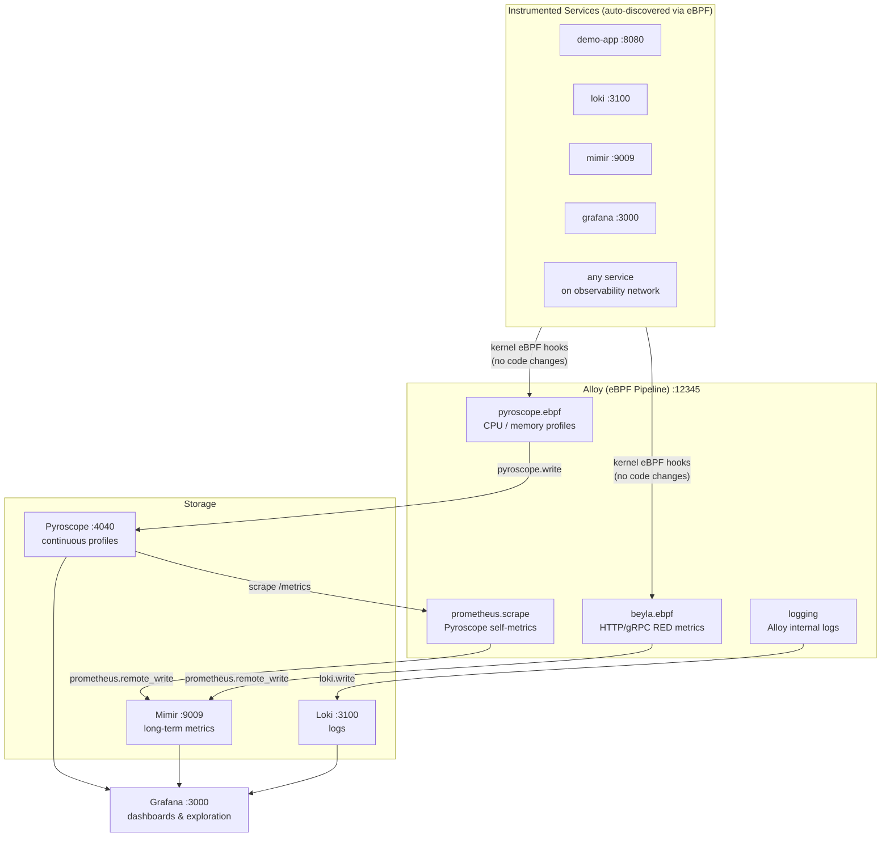

# Zero-Code Observability with eBPF + Grafana Stack

See what your services are doing — without touching a single line of their code.

## What is eBPF?

eBPF is a feature built into the Linux kernel. Think of it as a tiny spy that sits at the OS level and watches all network traffic going in and out of your services — no code changes, no restarts, no libraries to install inside your app.

Normally, to monitor an app you'd add a monitoring SDK to it, redeploy it, and maintain that code forever. With eBPF, you skip all of that.

## What this repo does

A complete, self-hosted observability stack. Drop it alongside any Docker-based workload and you instantly get:

- **Metrics** — request rate, error rate, latency (RED) for every service
- **Profiles** — continuous CPU/memory flame graphs via eBPF, no SDK needed
- **Logs** — aggregated and searchable
- **Dashboards** — pre-built, auto-populated, no configuration needed

Zero changes to your services. Zero instrumentation code.

## How it works



## Quick start

Requires: Docker + Docker Compose

```bash
docker-compose up -d

# Open Grafana
open http://localhost:3000   # admin / admin
# → Dashboards → "eBPF RED Metrics (Beyla)"
```

## Query metrics from the terminal

```bash
# One-time setup — creates a Grafana API token saved to .env
./scripts/bootstrap.sh

# Show request rate, error rate, and latency for all services
python3 scripts/query_metrics.py

# List every metric being captured
python3 scripts/query_metrics.py --list

# Run any custom PromQL query
python3 scripts/query_metrics.py --query 'rate(http_server_request_duration_seconds_count{service_name="nginx"}[5m])'
```

## Add your own service

1. Add it to `docker-compose.yml` on the `observability` network
2. Add its port to `alloy/config.alloy` in the `open_port` field
3. Restart Alloy: `docker-compose restart alloy`

Beyla picks it up automatically — no changes to your service needed.

## Stack

| Service    | URL                     | Purpose                  |
|------------|-------------------------|--------------------------|
| Grafana    | http://localhost:3000   | Dashboards (admin/admin) |
| Loki       | http://localhost:3100   | Logs                     |
| Mimir      | http://localhost:9009   | Metrics                  |
| Pyroscope  | http://localhost:4040   | Continuous profiling     |
| Alloy UI   | http://localhost:12345  | Pipeline status          |
| demo-app   | http://localhost:8080   | Sample nginx target      |

## Useful commands

```bash
docker-compose ps                  # check service health
docker-compose logs -f alloy       # tail Alloy logs
docker-compose restart alloy       # reload after config changes
docker-compose down                # stop everything
docker-compose down -v             # stop and wipe all data
```
