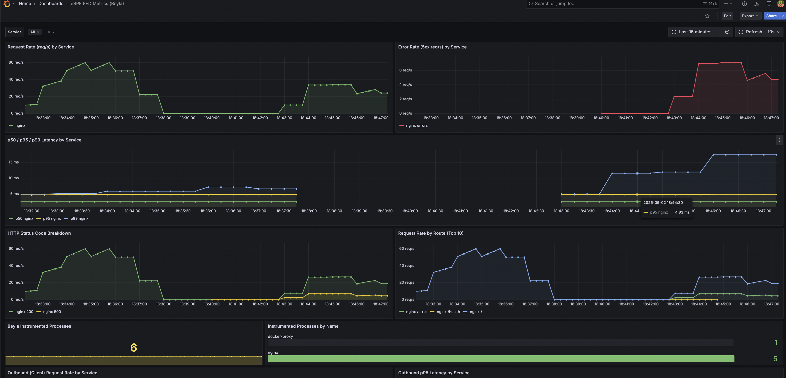

# eBPF Observability Demo — Zero Code Changes

This project is a hands-on demo for understanding where eBPF fits in an observability strategy.

It shows how you can get useful production signals such as CPU flamegraphs and HTTP RED metrics from running services without adding SDKs, changing application code, or restarting workloads for instrumentation.

```
Your services  ──eBPF──▶  Alloy  ──▶  Pyroscope  ──▶  Grafana (flamegraphs)
                                  └──▶  Mimir     ──▶  Grafana (RED metrics)
```

Grafana Alloy runs eBPF probes on the host. `pyroscope.ebpf` captures continuous CPU profiles, and Beyla captures HTTP/gRPC request metrics. The data is stored in Pyroscope and Mimir, then visualized in Grafana.

No SDKs. No code changes. Immediate visibility from outside the process.

---

## Why This Matters

In many production environments, getting observability coverage is harder than it should be:

- Some services are legacy, vendor-owned, or hard to modify.
- Some teams cannot quickly add OpenTelemetry SDKs everywhere.
- Some workloads are already heavily configured and only need basic service health signals.
- Some incidents need fast visibility before perfect instrumentation exists.

eBPF helps with that first layer of visibility. It observes the application from the kernel level, so you can see request rate, errors, duration, and CPU behavior without touching the application.

This does not replace full observability. It gives you a fast, low-friction baseline.

---

## Production Mindset

Use eBPF where it gives high value with low effort:

- RED metrics for HTTP/gRPC services: request rate, error rate, duration
- Continuous profiling: CPU hotspots, noisy processes, unexpected resource usage
- Coverage for services you cannot modify easily
- Quick visibility during migrations, audits, or incident response

Use application instrumentation where business and code context matters:

- Traces across service boundaries
- Custom business metrics
- Queue, database, cache, and dependency-level details
- User, tenant, feature, or workflow labels
- Domain-specific SLOs and alerts

The practical production answer is hybrid observability:

```
eBPF baseline visibility
  + OpenTelemetry traces
  + application metrics
  + logs
  + profiling
  = useful production observability
```

For some applications, eBPF RED metrics may be enough to understand service-level health. For critical systems, eBPF should be the baseline layer, with OpenTelemetry and app-level signals added where deeper visibility is required.

---

## Quick start

Requires Docker + Docker Compose. On macOS, use [Colima](https://github.com/abiosoft/colima) (eBPF needs a Linux kernel).

**1. Start the stack**

```bash
make up
```

**2. Generate some traffic**

The `demo-app` (nginx) starts automatically and is immediately visible to Alloy's eBPF probes.

```bash
make traffic
```

Pyroscope profiles processes even while they are idle. RED metrics need HTTP requests, so run `make traffic` before opening the RED dashboard.

By default, the traffic generator runs for 75 seconds with 20 workers and sends about 10% of requests to `/error`, a synthetic HTTP 500 endpoint. You can tune it:

```bash
DURATION_SECONDS=120 CONCURRENCY=30 ERROR_PERCENT=15 make traffic
```

**3. Open Grafana**

```
http://localhost:3000  →  admin / admin
```

Go to Dashboards and open:
- `CPU Flamegraph` — live eBPF CPU profiles for every process
- `eBPF RED Metrics (Beyla)` — request rate, error rate, latency by service

## Demo Screenshot



---

## What This Demo Proves

This demo runs a plain nginx container with no application instrumentation. Alloy still discovers the process and collects:

- Request rate by service
- Synthetic 5xx error rate
- Latency percentiles
- HTTP status code breakdown
- Request rate by route
- Instrumented process count
- CPU profiles through eBPF

That is the core idea: even before you add application SDKs, you can still get useful operational signals.

It also shows the boundary. eBPF can tell you what is happening at the service and process level, but it cannot know every business concept inside your code. That is why production systems usually need eBPF plus application instrumentation, not one or the other.

---

## Architecture

| Service     | Port  | Role                              |
|-------------|-------|-----------------------------------|
| Grafana     | 3000  | Dashboards                        |
| Pyroscope   | 4040  | Continuous CPU profile storage    |
| Mimir       | 9009  | Long-term Prometheus metrics      |
| Alloy       | 12345 | eBPF pipeline + web UI            |
| demo-app    | 8080  | Sample nginx target               |

All services share the `ebpf` Docker bridge network and communicate via service names.

The demo app exposes:
- `/` — HTTP 200 success response
- `/error` — HTTP 500 synthetic error response
- `/health` — HTTP 200 health check

---

## Profiling your own services

Add any service to `docker-compose.yml` on the `ebpf` network:

```yaml
services:
  my-app:
    image: my-app:latest
    networks:
      - ebpf
```

`pyroscope.ebpf` profiles all processes automatically — no Alloy config change needed.

For RED metrics, also add the service port to `open_ports` in `alloy/config.alloy`, then run `make restart`.

---

## Useful commands

```bash
make up       # start everything
make down     # stop everything
make restart  # reload Alloy after config changes
make logs     # tail Alloy logs
make ps       # check service health
make traffic  # generate demo HTTP requests
make metrics  # query RED metrics through Grafana
make clean    # stop and wipe all volumes
```

---

## macOS setup (Colima)

eBPF requires a Linux kernel. On macOS:

```bash
brew install colima
colima start --cpu 4 --memory 8 --mount-type virtiofs
make up
```
